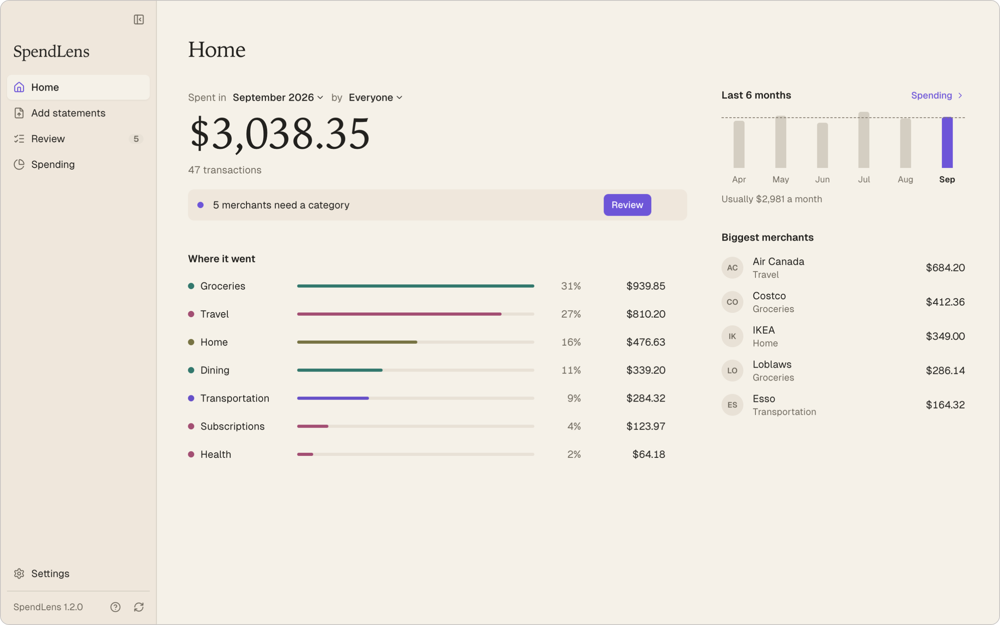
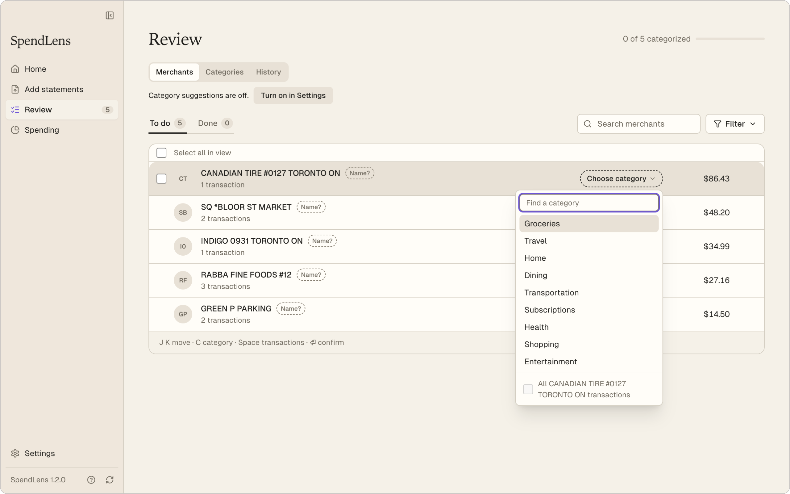
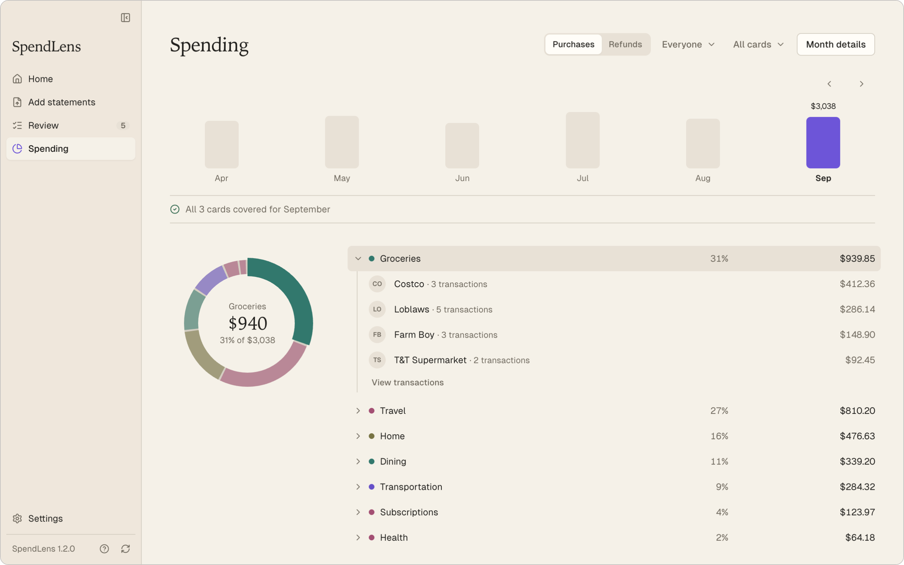

<h1 align="center">
  
</h1>

  <strong>See where your household's money goes. Your statements never leave your Mac.</strong>

  

  Free · macOS 13 or later · Apple Silicon and Intel · No account needed

  

Screenshots show a made-up household.

## What it does

- **Keeps your data private.** No account, no sign-in. Everything is stored on your Mac.
- **Brings every card together.** Add statements for each card and person in your household.
- **Remembers your categories.** Pick a category for a merchant once and it sticks.
- **Shows the month at a glance.** Totals by category, merchant, person and card.

## How it works

1. **Add statements.** Download the CSV file for a card from your bank's website and drop it in. SpendLens reads files from BMO, American Express, Scotiabank and Wealthsimple cards.
2. **Review.** Give each new merchant a category.
3. **See the month.** Open any category to see where the money went.

  
  

## Privacy

SpendLens works without the internet. Category suggestions are optional and off until you turn them on in Settings. When on, they send business names like `IKEA`. For a business SpendLens doesn't recognize, they send the statement line as written, which can include a city and store number.

Your statement files, amounts, dates, people and cards are never sent. Help in the app lists exactly what each setting shares.

## Install

1. Open the **[latest release](https://github.com/AliAbdelhamid1/SpendLens-Releases/releases/latest)** and download the file ending in `_universal.dmg` under **Assets**.
2. Open it and drag **SpendLens** into **Applications**.
3. Open SpendLens. macOS blocks it the first time because this free app is not notarized by Apple. Go to **System Settings → Privacy & Security**, click **Open Anyway**, and confirm. Apple's guide: [Open a Mac app from an unknown developer](https://support.apple.com/guide/mac-help/open-a-mac-app-from-an-unknown-developer-mh40616/mac).

Only download SpendLens from this page. Never disable Gatekeeper or use Terminal commands to open it. If it still won't open, send the maintainer the exact message macOS shows.

Tested so far on macOS 26 on Apple Silicon.

## Updates

SpendLens tells you when a new version is ready. Open **App** near the top-left and choose **Download and restart**, or **Later** to wait. Your data stays in place.

If an update fails, don't delete anything or install an older version. Contact the maintainer.

## About this repository

It holds downloads and update information only, not source code or anyone's data. Published releases are never changed. An unsafe release is withdrawn in full and replaced with a new version.

## Withdrawn releases

| Version | UTC withdrawal date | Reason | Replacement |
| --- | --- | --- | --- |
